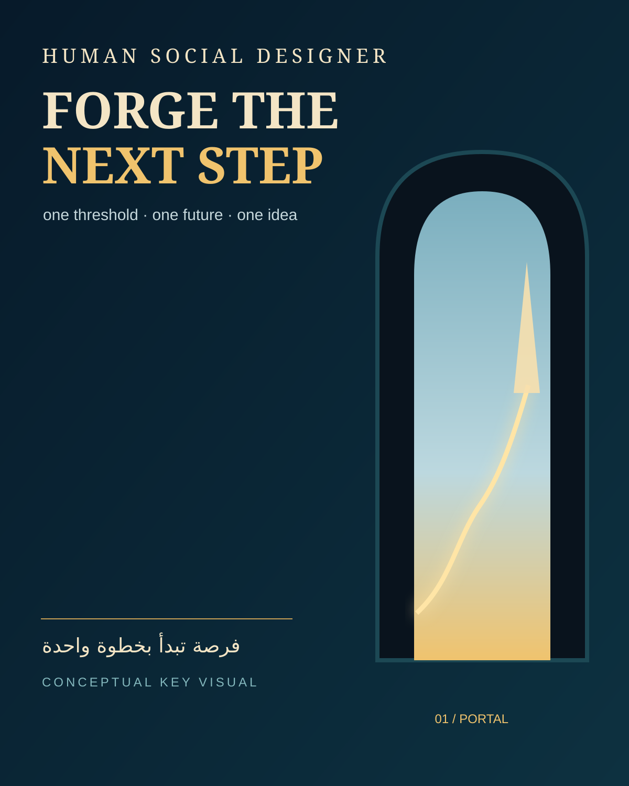
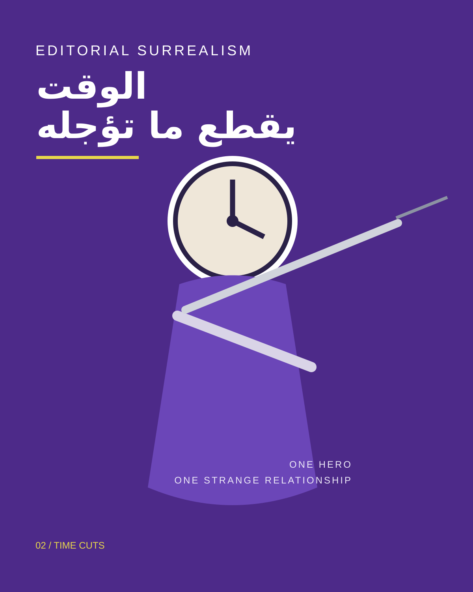
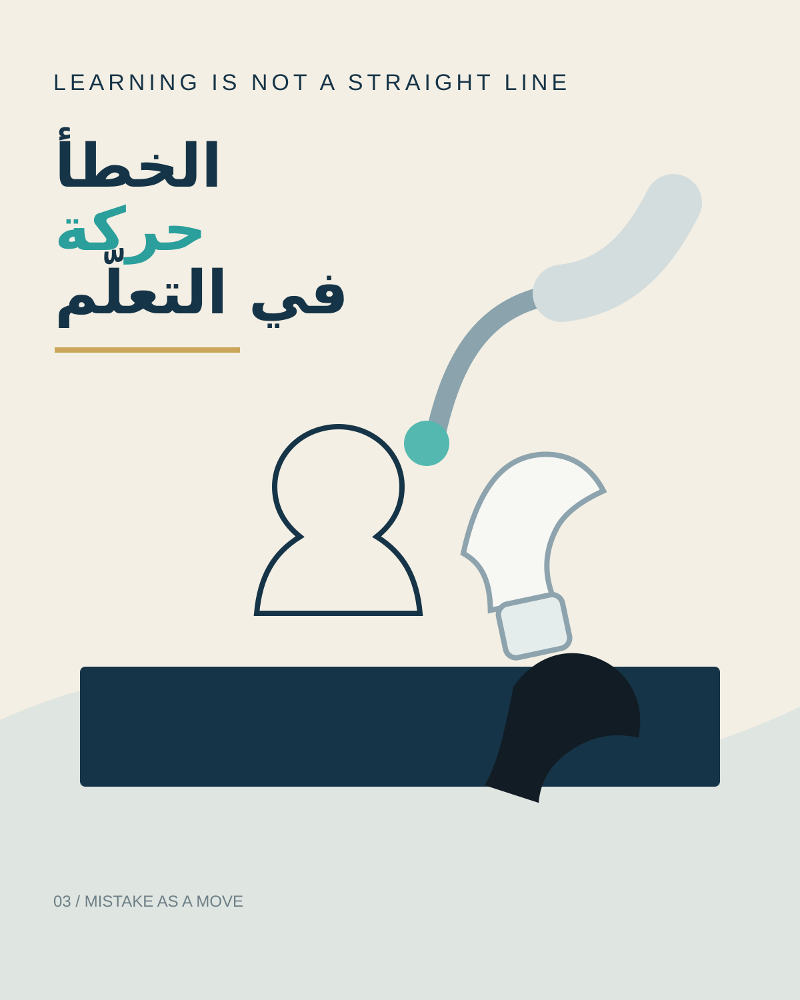

# Visual Examples

These examples are **art-direction diagrams**, not production templates and not literal designs to copy.

They demonstrate the skill's preferred decision pattern:

1. suppress most information
2. choose one visual metaphor
3. build one dominant silhouette
4. reserve intentional negative space
5. use one short headline
6. keep branding / metadata tiny

## 01 — Portal / Opportunity

**Brief:** promote an opportunity / hackathon / future-facing program.

**Concept:** one monumental threshold reveals a brighter path.

**Why it works:** the architecture communicates transition and possibility without requiring students, laptops, icons, or a detailed event flyer.

**Text budget:** title + one short hook + optional date/CTA.

## 02 — Time Cuts

**Brief:** procrastination / urgency / time management.

**Concept:** time is treated as a physical cutting force.

**Why it works:** one strange relationship carries the whole message. The scene remains memorable even with typography removed.

**Text budget:** one short Arabic phrase only.

## 03 — Mistake / Chess

**Brief:** learning from mistakes / experimentation / intelligent failure.

**Concept:** a precise mechanical hand deliberately disrupts a chess position.

**Why it works:** it avoids warning icons and generic technology imagery while keeping the idea readable.

**Text budget:** one headline + optional tiny support line.

## Important

Do not reuse these same objects mechanically. They show **principles**, not a fixed visual library.

A new brief should lead to a new metaphor.
